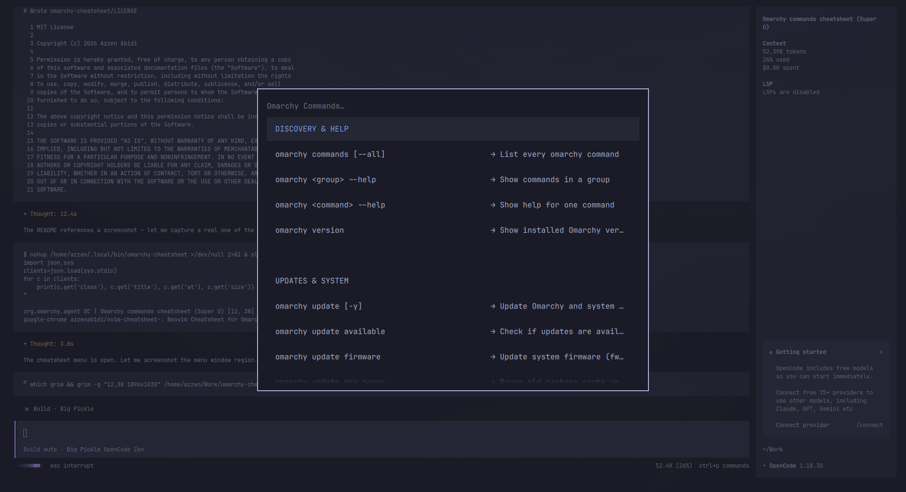

# omarchy-cheatsheet

An interactive cheatsheet for [Omarchy](https://omarchy.org/) terminal commands,
shown through the Omarchy menu. Press **Super + O** to open it, just like the
Neovim cheatsheet on **Super + N**.



## What it shows

~130 curated, user-facing `omarchy` commands with a one-line description of what
each does, grouped by category:

- Discovery & help
- Updates & system
- Theme & look
- Capture, recording & screen
- Audio & transcode
- Display & brightness
- Toggles
- Windows & workspaces
- Reminders & clipboard
- Restart & reload
- Reset to defaults
- Launch & default apps
- Packages, install & remove
- Bar & plugins
- Setup & security
- Windows, webapps & TUIs
- Network & weather

## Installation

```bash
# Install the script on your PATH
install -m755 omarchy-cheatsheet ~/.local/bin/omarchy-cheatsheet
```

## Super + O binding

Add to `~/.config/hypr/bindings.lua`. `SUPER + O` is bound to
*Pop window out* by default, so unbind it first:

```lua
-- Omarchy Cheatsheet on SUPER O (was: Pop window out)
hl.unbind("SUPER + O")
o.bind("SUPER + O", "Omarchy Cheatsheet", "omarchy-cheatsheet")
```

Hyprland auto-reloads on save. Verify with:

```bash
hyprctl reload && hyprctl configerrors
```

## Requirements

- An Omarchy system with the `omarchy` CLI on your `PATH`
- The Omarchy menu (`omarchy menu select`) for display

## License

[MIT](LICENSE)